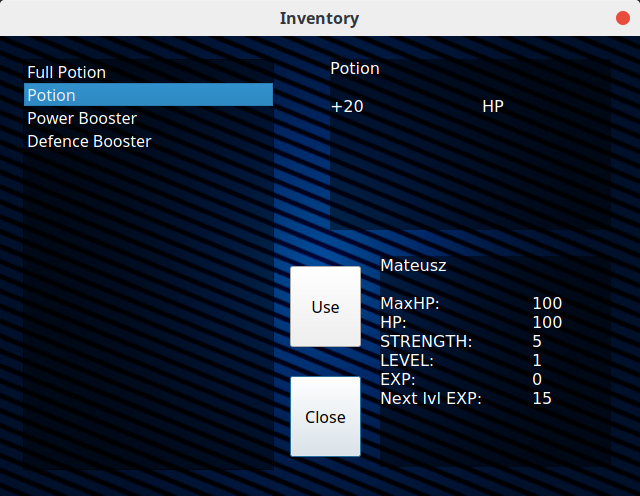
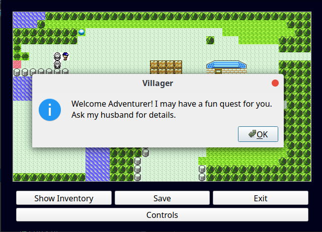

# RPG Haunted House Game
This repository contains an Haunted House themed RPG game, written in C++ 11 as a class project, uses Qt framework, developed in CLion. 

### Gameplay and features

Game is a (at least in a graphical sence) copy of popular Nintendo game Pokemon available on Gameboy back in the day. Player changes locations by entering doors or pathways. The game supports saving current state of the game as well as loading it from previously saved load files. 

Player can find different elements on the map and store them in the inventory.

Inventory is available to user at any given time during normal gameplay as well as during combat scene. After using the element it becomes exhausted.

Throughout the game player can come across different enemies. If a player interacts with the enemy, the player is moved to the combat screen, where a player can decide whether to attack the enemy or try to flee. Additionally a player can access inventory window whenever needed. 

Throughout the game the player can interact with different characters who may give quests and guidelines.

### Dependencies

All qt4 related packages. `qt4-default`, `qt4-qmake`, `libqt4-dev`.

